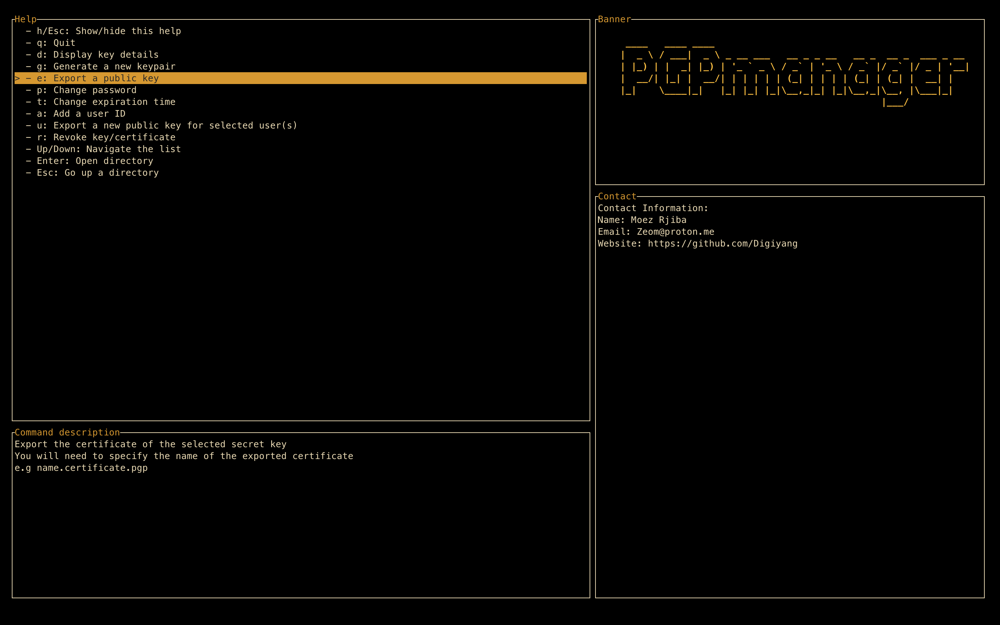

# PGPManager


[](https://www.gnu.org/licenses/gpl-3.0)
[](https://github.com/Digiyang/PGPManager/issues)
<!-- [] (https://github.com/Digiyang/PGPManager/stargazers) -->
<!-- [](https://github.com/Digiyang/PGPManager/network) -->

PGPmanager is a Terminal User Interface (TUI) designed to facilitate and manage the process of PGP (Pretty Good Privacy) key management.

<!-- Anyone checking this out and who would be qualify to use it, will know what PGP is, so lets get straight to the point. -->
<!-- PGP is a widely-used encryption standard that allows users to secure their communication and data by encrypting messages and files with public and private keys. -->
The primary purpose of PGPmanager is to provide an intuitive and interactive interface for users to perform various PGP key operations, such as:
<!-- created a list, as this text got very long. As this is repetitive because of the feature section below, you might just take it out? -->
- generating key pairs 
- exporting and importing certificates 
- editing passwords and expiration times
- revoking keys 
- and more 

The application serves as a bridge between the user and the underlying functionality provided by the [Sequoia-OpenPGP](https://sequoia-pgp.org/) crate, a powerful library for PGP key management in Rust.

---

## Releases

PGPManager is currently in its *Alpha* stage. 

### Release Notes
This tool was developed as part of a bachelor thesis and my first project written in [Rust](https://www.rust-lang.org/), leveraging [PGP](https://www.openpgp.org/). As such, it may have security flaws, bugs or contain boilerplate code. Reviews, critiques, and contributions are highly appreciated.

I plan to release stable versions on popular package managers like Cargo, Homebrew, and others in the near future. Stay tuned for updates!

---

## Features


- Generate PGP keypair & revocation certificates
- Export public keys
- Edit key passwords and expiration times
- Add/Delete users
- Revoke keys
<!-- user can .... for each user -- is unclear who user is, --better?: contact, recipient -->
- Users can choose to extract a public key for each user and with the same private key 
- User-friendly and robust interface.

---

## Table of Contents

- [PGPManager](#pgpmanager)
  - [Future Releases](#future-releases)
  - [Features](#features)
  - [Table of Contents](#table-of-contents)
  - [Getting Started](#getting-started)
  - [Installation](#installation)
    - [Prerequisites](#prerequisites)
    - [Installation Steps](#installation-steps)
  - [Usage](#usage)
- [Contributing](#contributing)
- [License](#license)
- [Contact](#contact)
- [Copyright](#copyright)

---

## Getting Started

<!-- does this section need to be here? It doesnt contribute a significant information -->
To get started with PGPManager, follow the installation instructions below.

---

## Installation

### Prerequisites

Before you can run the Terminal User Interface, you must first ensure that your system meets the necessary requirements.

1. Rust programming language:

The TUI is written in Rust, so Rustup, the installation and version management program for Rust, is required. If Rust is not installed on your system, please visit [the official Rust website](https://www.rust-lang.org/). for installation instructions.

1. Sequoia OpenPGP Crate:

The TUI relies on the Sequoia OpenPGP crates for certificate management. You must have certain dependencies installed in your system. Visit [the Sequoia repository](https://gitlab.com/sequoia-pgp/sequoia) for detailed instructions on the required libraries for different
different platforms

### Installation Steps

1. Clone this repository to your local machine:

   ```bash
   git clone https://github.com/Digiyang/PGPManager.git
   ```

2. Change to the project directory:

   ```bash
   cd gui
   ```

3. Build the application:
      ```bash
      cargo build --release
      ```

4. Run the application:
      ```bash
      cargo run --release
      ```

---

## Usage
- Use the arrow keys to navigate through the interface.
- Press `h` to view the help menu.
- Press `q` to quit the application.
- Press `Enter` to select an open a directory.
- Press `Space Bar` to go back to the previous directory.
- Press `Esc` to abort the current operation.
- Press `d` to get key details.
- Press `g` to generate a key.
- Press `e` to export a key.
- Press `a` to add a user.
- Press `p` to change a password.
- Press `t` to modify a key expiration time.
- Press `u` to export a new public key for selected user(s).
- Press `r` to revoke a key.
- Follow the on-screen prompts to perform various key operations.

---

# Contributing
Contributions are welcome! Feel free to open [issues](https://github.com/Digiyang/PGPManager/issues) for any improvements or bug fixes.

---

# License
This project is licensed under the GNU General Public License v3.0 - see the [LICENSE](LICENSE) file for details.

---

# Contact
<!-- dude, you re handling pgp and not providing a pgp key? :D -->
- Email: [moez@rjiba.de](mailto:moez@rjiba.de) | [PK](https://keys.openpgp.org/vks/v1/by-fingerprint/86A99D41E4949A6C69F146DCFFECDB3134787C18)
- LinkedIn: [Moez Rjiba](https://www.linkedin.com/in/moez-rjiba-1a3ab21a2/)
<!-- allthough here on github, they will be on your profile right? -->

# Copyright
Copyright © 2023, [Moez Rjiba](moez-rjiba.de). All rights reserved.
